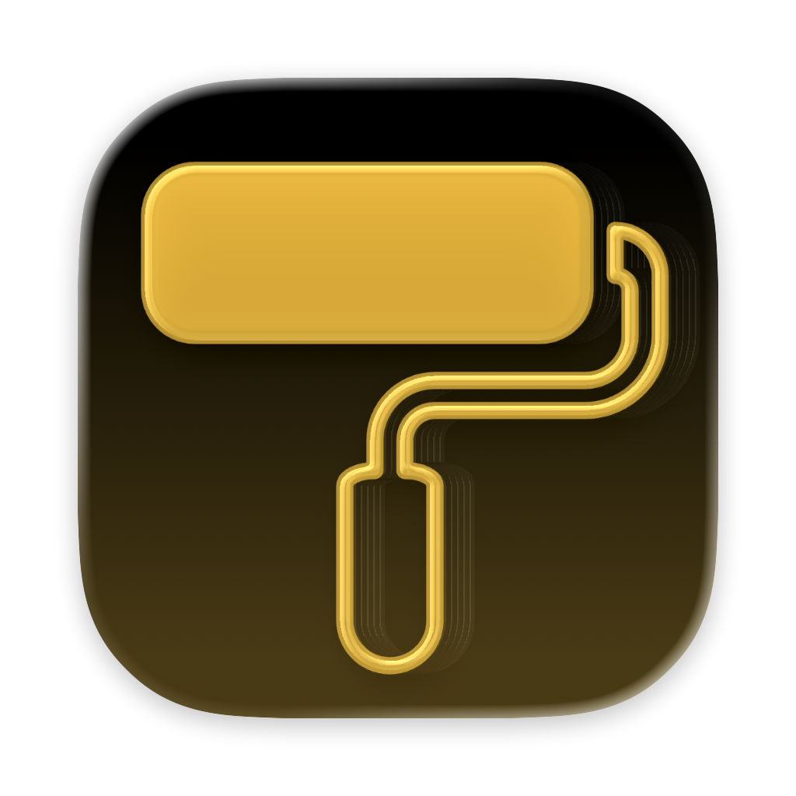
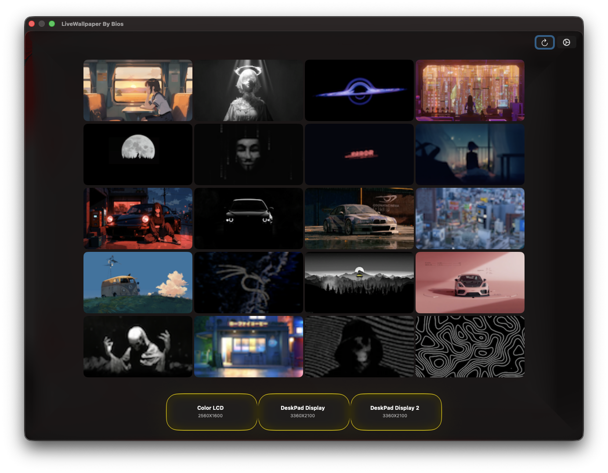
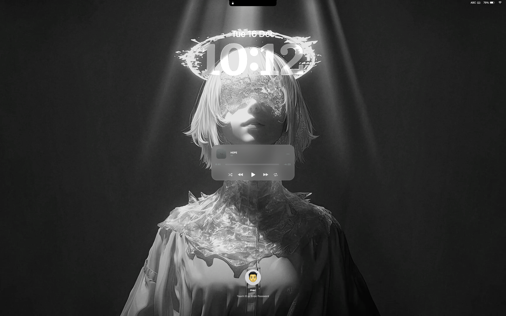
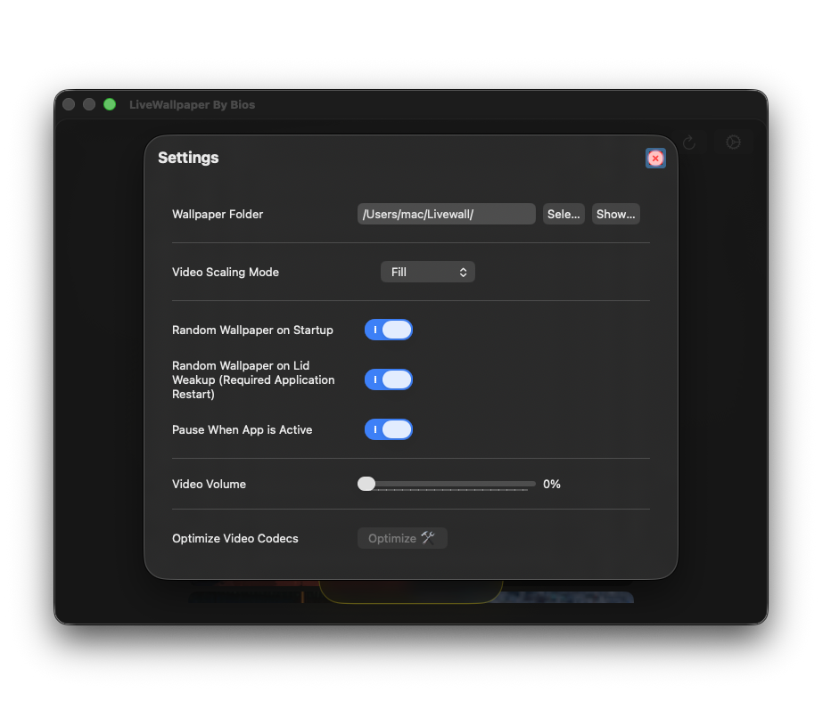
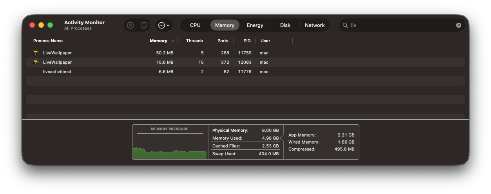
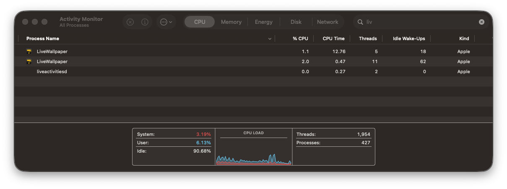
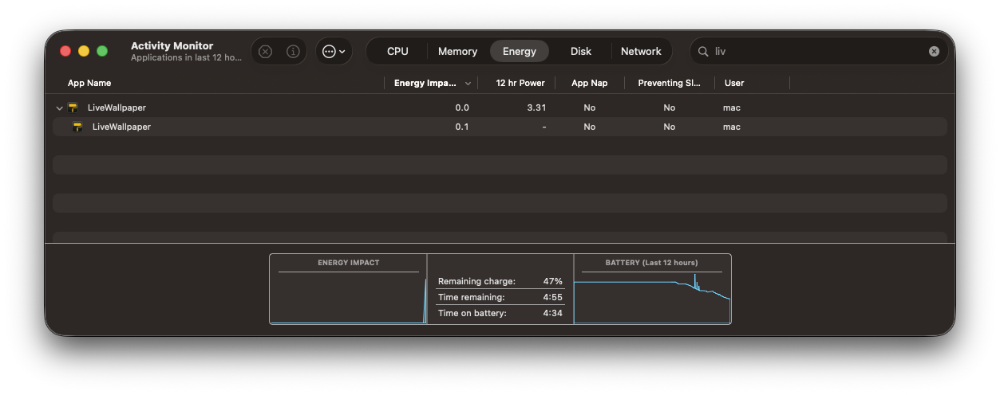

> [!NOTE]
> ## I’ll be Transforming Objective C++ UI's to SwiftUI. But the ```daemon``` won't change.

# LiveWallpaper App for MacOS 14+

**Languages:** English | [简体中文](README.zh-Hans.md)



This is an open-source live wallpaper application for MacOS 14+

## Install using brew

Run this on terminal `brew tap thusvill/livewallpaper && brew install --cask livewallpaper`

## Installation(Compile from source)
- macOS 14+
- git
- Xcode
- Cmake
  
Run this: `git clone https://github.com/thusvill/LiveWallpaperMacOS.git && cd LiveWallpaperMacOS && mkdir -p build && cd build && cmake .. && make -j$(sysctl -n hw.ncpu)`


## Guide for DMG Installation

> [!IMPORTANT]
> ## Fix “LiveWallpaper.app” is corrupted and cannot be opened. It is recommended that you move the object to the recycle bin.
> After you install the app in Application folder you have to bypass Gatekeeper to run this since I don't want to pay apple for opensource apps.
> 
> This will solve the occupation issue
> 
> `xattr -d com.apple.quarantine /Applications/LiveWallpaper.app` 

Click the "OpenInFinder" button and it'll open a folder, you can place wallpapers in it.

> [!NOTE]
> Make sure the folder selected doesn't include spaces.
>
> No dots should be contained on the file name exept the dot for extension!
> 
> ## Eg:
> 
>  - file.1920x1080.mp4 ❌ ('.'s > 1)
> 
>  - file-1920x1080.mp4 ✅ ('.'s = 1)

> [!NOTE]
> Currently support for `.mp4` and `.mov`

> https://github.com/user-attachments/assets/3d82e07d-b6b9-4a7d-b6de-5dd05dff3128

## Gallery

> 

> ## This is a static image, currently LiveWallpaper doesn't support videos on the lock screen.
> 

> 

> https://github.com/user-attachments/assets/36fb169e-b7cc-4489-9459-dab07c8dd2c6


> # Performance
> 
> 
> 
> # Multiple Display Support

> https://github.com/user-attachments/assets/9575873c-79e6-4eba-a7a5-9408b2cc4ed0


<!-- ## Gallery
> 
> 
 


> 

> 

> 

 

> https://github.com/user-attachments/assets/748c7078-1f99-4182-876f-08aa59d2bc63 -->
 

For licensing details, see [LICENSE](LICENSE).
